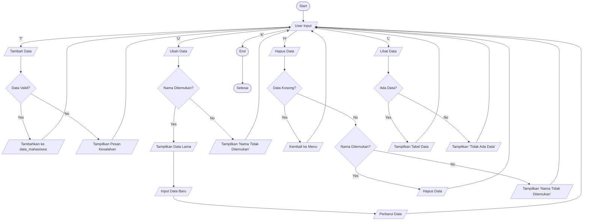

## INPUT PROGRAM

```
# Dictionary untuk menyimpan data mahasiswa
data_mahasiswa = {}

# Fungsi untuk menambah data mahasiswa
def tambah(nama, nilai):
    if nama in data_mahasiswa:
        print(f"Data dengan nama {nama} sudah ada!")
    else:
        data_mahasiswa[nama] = nilai
        print(f"Data {nama} berhasil ditambahkan.")

# Fungsi untuk menampilkan data mahasiswa
def tampilkan():
    if not data_mahasiswa:
        print("Tidak ada data yang tersimpan.")
    else:
        print("Daftar Nilai Mahasiswa:")
        for nama, nilai in data_mahasiswa.items():
            print(f"Nama: {nama}, Nilai: {nilai}")

# Fungsi untuk menghapus data mahasiswa berdasarkan nama
def hapus(nama):
    if nama in data_mahasiswa:
        del data_mahasiswa[nama]
        print(f"Data {nama} berhasil dihapus.")
    else:
        print(f"Data dengan nama {nama} tidak ditemukan.")

# Fungsi untuk mengubah data mahasiswa berdasarkan nama
def ubah(nama, nilai_baru):
    if nama in data_mahasiswa:
        data_mahasiswa[nama] = nilai_baru
        print(f"Data {nama} berhasil diubah.")
    else:
        print(f"Data dengan nama {nama} tidak ditemukan.")

# Program utama
print("Program Pengelolaan Data Nilai Mahasiswa")
while True:
    print("\nPilih opsi:")
    print("1. Tambah Data")
    print("2. Tampilkan Data")
    print("3. Hapus Data")
    print("4. Ubah Data")
    print("5. Keluar")
    
    pilihan = input("Masukkan pilihan (1-5): ")
    
    if pilihan == "1":
        nama = input("Masukkan nama mahasiswa: ")
        nilai = int(input("Masukkan nilai mahasiswa: "))
        tambah(nama, nilai)
    elif pilihan == "2":
        tampilkan()
    elif pilihan == "3":
        nama = input("Masukkan nama mahasiswa yang ingin dihapus: ")
        hapus(nama)
    elif pilihan == "4":
        nama = input("Masukkan nama mahasiswa yang ingin diubah: ")
        nilai_baru = int(input("Masukkan nilai baru: "))
        ubah(nama, nilai_baru)
    elif pilihan == "5":
        print("Program selesai.")
        break
    else:
        print("Pilihan tidak valid!")
```

## OUTPUT PROGRAM

```
Program Pengelolaan Data Nilai Mahasiswa

Pilih opsi:
1. Tambah Data
2. Tampilkan Data
3. Hapus Data
4. Ubah Data
5. Keluar
Masukkan pilihan (1-5): 1
Masukkan nama mahasiswa: Habib Fatih Zanjabilah
Masukkan nilai mahasiswa: 97
Data Habib Fatih Zanjabilah berhasil ditambahkan.

Pilih opsi:
1. Tambah Data
2. Tampilkan Data
3. Hapus Data
4. Ubah Data
5. Keluar
Masukkan pilihan (1-5): 2
Daftar Nilai Mahasiswa:
Nama: Habib Fatih Zanjabilah, Nilai: 97

Pilih opsi:
1. Tambah Data
2. Tampilkan Data
3. Hapus Data
4. Ubah Data
5. Keluar
Masukkan pilihan (1-5): 4
Masukkan nama mahasiswa yang ingin diubah: Habib Fatih Zanjabilah
Masukkan nilai baru: 100
Data Habib Fatih Zanjabilah berhasil diubah.

Pilih opsi:
1. Tambah Data
2. Tampilkan Data
3. Hapus Data
4. Ubah Data
5. Keluar
Masukkan pilihan (1-5): 2
Daftar Nilai Mahasiswa:
Nama: Habib Fatih Zanjabilah, Nilai: 100

Pilih opsi:
1. Tambah Data
2. Tampilkan Data
3. Hapus Data
4. Ubah Data
5. Keluar
Masukkan pilihan (1-5): 3
Masukkan nama mahasiswa yang ingin dihapus: Habib Fatih Zanjabilah
Data Habib Fatih Zanjabilah berhasil dihapus.

Pilih opsi:
1. Tambah Data
2. Tampilkan Data
3. Hapus Data
4. Ubah Data
5. Keluar
Masukkan pilihan (1-5): 2
Tidak ada data yang tersimpan.

Pilih opsi:
1. Tambah Data
2. Tampilkan Data
3. Hapus Data
4. Ubah Data
5. Keluar
Masukkan pilihan (1-5): 5
Program selesai.
```
## PENJELASAN

# Menu Utama Program
Ketika program dijalankan, pengguna akan melihat menu utama dengan 5 pilihan:
```
1. Tambah Data
2. Tampilkan Data
3. Hapus Data
4. Ubah Data
5. Keluar
```

# Fungsi dari Setiap Pilihan
Tambah Data
Pengguna dapat menambahkan data mahasiswa baru.
Nama: Habib Fatih Zanjabilah
Nilai: 97
Data ini akan disimpan ke dalam daftar mahasiswa.

# Tampilkan Data
Menampilkan semua data mahasiswa yang telah disimpan.
```
Daftar Nilai Mahasiswa:
Nama: Habib Fatih Zanjabilah, Nilai: 97
```

# Hapus Data
Menghapus data mahasiswa berdasarkan nama yang dimasukkan.
Jika pengguna ingin menghapus data Habib Fatih Zanjabilah, maka data tersebut akan dihapus dari daftar.
```
Data Habib Fatih Zanjabilah berhasil dihapus.
```

# Ubah Data
Mengubah nilai mahasiswa berdasarkan nama yang dimasukkan.
```
Nama: Habib Fatih Zanjabilah
Nilai Baru: 100
```

# Keluar
Mengakhiri program.


## FLOWCHART



